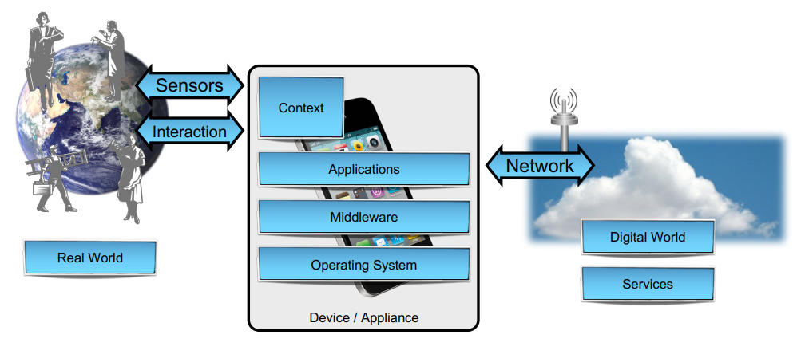
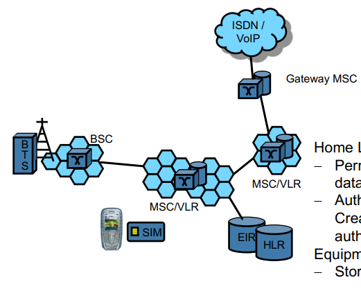

<html><head><link href="style.css" rel="stylesheet"/></head><body>

01 - Introduction

<h1 class="collapsible" id="questions">Questions</h1>

<h2 class="collapsible" id="what-makes-mobile-devices-and-wireless-communication-special-from-a-security-and-privacy-point-of-view">What makes mobile devices and wireless communication special from a security and privacy point of view</h2>

<ul>
<li>Resource constraints: Size, portability, battery, ...</li>
<li>Usage and setting: (non-)interactive, assistive, non-expert users, specialized</li>
<li>Availability of network might vary (scatterig, refraction, reflection, ...)</li>
</ul>

<h1 class="collapsible" id="introduction-to-mobile-systems">Introduction to mobile systems</h1>

<h2 class="collapsible" id="components-of-mobile-systems">Components of mobile systems</h2>

<ul>
<li>Mobile devices communicate to with real world through sensors and with digital world through networks</li>
</ul>

<h1 class="collapsible" id="security-and-privacy-challenges-and-requirements">Security and privacy challenges and requirements</h1>

<h2 class="collapsible" id="source-of-bad-security">Source of bad security</h2>

<ul>
<li>PC-like platforms offer more flexibility</li>
<li>Proprietary design, security and crypto without public review</li>
<li>Resource contraints prevents proper security</li>
<li>Physical access to systems</li>
<li>Radio communication makes eavesdropping and message injection easy</li>
<li>Versatility of operational environment</li>
</ul>

<h1 class="collapsible" id="example-of-attacks">Example of attacks</h1>

<h2 class="collapsible" id="examples">Examples</h2>

<ul>
<li>Android Malware</li>
<li>Trojan spyware (Zitmo)</li>
<li>OV Chipcard attack (NXP Mifare)</li>
<li>Attacks on passive keyless entry systems for cars</li>
</ul>

<h2 class="collapsible" id="zitmo">Zitmo</h2>

<ul>
<li>ZitMo (Zeus in the mobile)</li>
<li>Trojan horse 
</li>
</ul>

02 - Location Privacy

<h1 class="collapsible" id="questions">Questions</h1>

<h2 class="collapsible" id="privacy-implications-using-mobile-systems">Privacy implications using mobile systems</h2>

<h2 class="collapsible" id="to-what-extent-can-location-data-be-extracted-whar-information-can-be-revealed-from-it">To what extent can location data be extracted, whar information can be revealed from it</h2>

<h2 class="collapsible" id="what-approaches-exist-for-protecting-location-privacy-while-allowing-location-based-services">What approaches exist for protecting location privacy while allowing location based services##</h2>

<h1 class="collapsible" id="privacy-in-smartphones">Privacy in smartphones</h1>

<h2 class="collapsible" id="challenges-concerning-privacy-in-mobile-systems">Challenges concerning privacy in mobile systems</h2>

<ul>
<li>Mobile devices contain a lot of personal data</li>
<li>Photos, email, contacts, call logs, caches, history, accounts, ...</li>
<li>Most data is stored unsecured on mobile devices</li>
<li>Backend communication often in the clear</li>
</ul>

<h2 class="collapsible" id="sensitive-vs-valuable-data">Sensitive vs valuable data</h2>

<ul>
<li>Sensitive: personal data that would rather be destroyed than published</li>
<li>Valuable: data interesting to an advertising company</li>
</ul>

<h2 class="collapsible" id="examples-of-tracking">Examples of tracking</h2>

<ul>
<li>Websites with cookies</li>
<li>Tracking of cars (license plates, tolling, ...)</li>
<li>CCTV</li>
<li>Mobile phone traces</li>
</ul>

<h2 class="collapsible" id="data-collectors">Data collectors</h2>

<ul>
<li>Cellphone providers</li>
<li>Device / OS vendors</li>
<li>Application owners</li>
<li>Websites</li>
</ul>

<h2 class="collapsible" id="identifiers">Identifiers</h2>

<ul>
<li>Device ID, IMEI, IMSI</li>
<li>MAC address</li>
<li>Email</li>
<li>Cookies</li>
<li>Fingerprints</li>
</ul>

<h2 class="collapsible" id="location-approximation">Location approximation</h2>

<ul>
<li>GPS</li>
<li>IP address</li>
<li>Cell-based</li>
<li>Localized searches (e.g. uni ulm, ...)</li>
<li>Example: Metadata from cellular networks</li>
</ul>

<h2 class="collapsible" id="position-samples">Position samples</h2>

<ul>
<li>(timestamp, coordinates, ID, other data)</li>
</ul>

<h2 class="collapsible" id="self-localization-vs-system-localization">Self-localization vs system-localization</h2>

<ul>
<li>self
<ul>
<li>you/your devices wants to learn location</li>
</ul>
</li>
<li>system:
<ul>
<li>System localizes you/devices</li>
</ul>
</li>
</ul>

<h1 class="collapsible" id="location-privacy">Location privacy</h1>

<h2 class="collapsible" id="location-data-protection">Location data protection</h2>

Position sample: (timestamp, coordinates, ID, other data)

<ul>
<li>No publish</li>
<li>Anonymous publication</li>
<li>Pseudonymous publication</li>
<li>Obfuscation (reducing granularity in time and spacy)</li>
<li>Aggregated data</li>
<li>protected access</li>
</ul>

<h2 class="collapsible" id="pets">PETs</h2>

<ul>
<li>Location privacy proxy</li>
<li>Mixed zones</li>
</ul>

<h2 class="collapsible" id="location-privacy-proxy">Location privacy proxy</h2>

<ul>
<li>Trusted middleware provides anonymity</li>
<li>Makes location based services available</li>
</ul>

<h2 class="collapsible" id="mixed-zones">Mixed zones</h2>

<ul>
<li>No localization of users and interaction with applications in mixed zones</li>
<li>Localization and interaction with applications only in application zone</li>
</ul>

<h1 class="collapsible" id="protection-mechanisms">Protection mechanisms</h1>

<h2 class="collapsible" id="user-privacy-protection-mechanisms">User privacy protection mechanisms</h2>

<ul>
<li>Off-switch</li>
<li>legal protection</li>
<li>technical protection
<ul>
<li>Obfuscation</li>
<li>Privacy proxies</li>
<li>Pseudonyms</li>
</ul>
</li>
</ul>

03 - Mobile Device Security

<h1 class="collapsible" id="questions">Questions</h1>

<h2 class="collapsible" id="security-considerations-for-mobile-devices">Security considerations for mobile devices</h2>

<ul>
<li>Main personal devices for internet access</li>
<li>Personal user data</li>
<li>PC-like trends</li>
<li>Non-expert users</li>
<li>Extensive sensor data vailable (camera, microphone, GPS, inertia, ...)</li>
</ul>

<h2 class="collapsible" id="functionality-of-modern-smartphone-security-systems">Functionality of modern smartphone security systems</h2>

<h2 class="collapsible" id="ui-challenges-in-devices-blocking">UI Challenges in devices blocking</h2>

<h1 class="collapsible" id="android-and-android-security">Android and Android security</h1>

<h2 class="collapsible" id="android-overview">Android Overview</h2>

<ul>
<li>Software stack
<ul>
<li>OS, Middleware, Key applications</li>
</ul>
</li>
<li>Development tools
<ul>
<li>Android SDK, APIs</li>
</ul>
</li>
<li>Based on linux and java</li>
<li>Architecture</li>
</ul>
<table>
<thead>
<tr>
<th>System apps</th>
</tr>
</thead>
<tbody>
<tr>
<td>Java API</td>
</tr>
<tr>
<td>C/C++ libs / Android runtime</td>
</tr>
<tr>
<td>Hardware abstraction layer</td>
</tr>
<tr>
<td>Linux kernel</td>
</tr>
</tbody>
</table>
<ul>
<li>Heavily fragmented version market</li>
</ul>

<h2 class="collapsible" id="applications">Applications</h2>

<ul>
<li>Written in Java</li>
<li>Bundled as apk</li>
<li>Apps consist of components
<ul>
<li>Activity: UI</li>
<li>Service: Background</li>
<li>Content provider: Database</li>
<li>Broadcast receiver</li>
</ul>
</li>
<li>AIDL: Interface definition language</li>
<li>Manifest: Describes package, permissions</li>
</ul>

<h2 class="collapsible" id="security-mechanisms-in-android">Security Mechanisms in Android</h2>

<table>
<thead>
<tr>
<th>Type</th>
<th>Mechanism</th>
<th>Description</th>
<th>Purpose</th>
</tr>
</thead>
<tbody>
<tr>
<td><strong>Linux Mechanisms</strong></td>
<td>POSIX</td>
<td>Each app own UID</td>
<td>App isolation</td>
</tr>
<tr>
<td><strong>Linux Mechanisms</strong></td>
<td>File access</td>
<td>Controls access to files</td>
<td>App isolation</td>
</tr>
<tr>
<td><strong>Environmental Features</strong></td>
<td>MMU</td>
<td>Each app own address space</td>
<td>App isolation</td>
</tr>
<tr>
<td><strong>Environmental Features</strong></td>
<td></td>
<td>Type safety</td>
<td>Type safety enforced</td>
</tr>
<tr>
<td><strong>Environmental Features</strong></td>
<td>Mobile Carrier security</td>
<td>GSM security features</td>
<td>Prvent phone/identity theft</td>
</tr>
<tr>
<td><strong>Android specific</strong></td>
<td>App permissions</td>
<td>Permissions declared at installation time</td>
<td>Limits rights and authorises</td>
</tr>
<tr>
<td><strong>Android specific</strong></td>
<td>Component Encapsulation</td>
<td>Explicit control visibility</td>
<td>Access control, component isolation</td>
</tr>
<tr>
<td><strong>Android specific</strong></td>
<td>Signing Applications</td>
<td>apk signing and verification</td>
<td>Verification and cooperation between apps</td>
</tr>
<tr>
<td><strong>Android specific</strong></td>
<td>ART virtual machine</td>
<td>Apps run on own VM</td>
<td>App isolation</td>
</tr>
</tbody>
</table>

<h2 class="collapsible" id="andorid-security-enhancement-proposals">Andorid security enhancement proposals</h2>

<ul>
<li>Linux security: netfilter, IDSs, SELinux</li>
<li>Permissions systems</li>
</ul>

<h1 class="collapsible" id="application-and-app-store-security">Application and App Store security</h1>

<h2 class="collapsible" id="app-market-security-types">App market security types</h2>

<ul>
<li>Walled garden:
<ul>
<li>iOS</li>
<li>Installation only thorugh app store</li>
</ul>
</li>
<li>Guardian model
<ul>
<li>Android</li>
<li>Installation also possible by user or admin</li>
<li>Steal at least one security check before installation</li>
</ul>
</li>
<li>User control model
<ul>
<li>Developers can directly install software on device</li>
</ul>
</li>
</ul>

<h1 class="collapsible" id="device-locking">Device locking</h1>

<h2 class="collapsible" id="device-locking-approaches">Device locking approaches</h2>

<ul>
<li>PIN codes</li>
<li>patterns</li>
<li>Biometrics</li>
<li>Challenge/Response</li>
</ul>

<h2 class="collapsible" id="graphical-entry-schemes">Graphical entry schemes</h2>

<ul>
<li>Recall-based
<ul>
<li>Draw a secret scheme</li>
</ul>
</li>
<li>Recognition based
<ul>
<li>Select faces</li>
</ul>
</li>
<li>Cued recall systems:
<ul>
<li>Click on certain elements of an image in certain order</li>
</ul>
</li>
</ul>

<h2 class="collapsible" id="quality-of-device-locking-schemes">Quality of device locking schemes</h2>

<ul>
<li>Measured in entropy (bits)</li>
</ul>

<h2 class="collapsible" id="attacks-on-device-locking">Attacks on device locking</h2>

<ul>
<li>Smudge attacks</li>
<li>Probabilistic attacks</li>
<li>Bruteforce (low entropy)</li>
<li>Biometric bypass (photo, 3d model, fingerprint clone)</li>
</ul>

04 - WLAN Security

<h1 class="collapsible" id="questions">Questions</h1>

<h2 class="collapsible" id="concepts-of-wlan">Concepts of WLAN</h2>

<h2 class="collapsible" id="requirements-of-wlan-security">Requirements of WLAN security</h2>

<h2 class="collapsible" id="errors-in-wlan-security">Errors in WLAN security</h2>

<h2 class="collapsible" id="current-status-of-wlan-security">Current status of WLAN security</h2>

<h1 class="collapsible" id="wlan-intro-security-and-requirements">WLAN intro, security and requirements</h1>

<h2 class="collapsible" id="security-isues">Security isues</h2>

<ul>
<li>Large distance 200 - 500m</li>
<li>No physical access necessary</li>
<li>Simple eavesdropping</li>
</ul>

<h2 class="collapsible" id="wlan-specification">WLAN specification</h2>

<ul>
<li>specified in IEEE 802.11</li>
<li>Defines Physical and Medium Access (MAC) Layer</li>
<li>Physical
<ul>
<li>Frequency channels</li>
<li>Modulation schemes</li>
</ul>
</li>
<li>MAC layer
<ul>
<li>CSMA/CA</li>
<li>Data frames</li>
<li>Control frames: RTS, CTS, ACK</li>
<li>Management frames
<ul>
<li>Beacon</li>
<li>(Re-)Association Request/Response</li>
<li>Probe Request/Response</li>
<li>Disassociation frame</li>
<li>(De-)Auth frames</li>
</ul>
</li>
</ul>
</li>
</ul>

<h1 class="collapsible" id="breaking-wep">Breaking WEP</h1>

<h2 class="collapsible" id="wep-goals">WEP Goals</h2>

<ul>
<li>Confidentiality</li>
<li>Access control (Authentication &amp; Authorization)</li>
<li>Integrity</li>
</ul>

<h2 class="collapsible" id="wep">WEP</h2>

<ul>
<li>Wired Equivalent Privacy</li>
<li>Intended to provide ethernet (link layer) equivalent security</li>
<li>2 main protocols: encryption &amp; authentication</li>
</ul>

<h2 class="collapsible" id="wep-encryption">WEP Encryption</h2>

<ul>
<li>MS: mobile station</li>
<li>AP: Access point</li>
</ul>
<ol>
<li>MS and AP agree on secret key k</li>
<li>Calculate Payload Integrity Check (ICV) with CRC-32</li>
<li>Encrypt Payload + ICV with RC4 (keystream XOR) and initialization vector (IV)</li>
<li>Send IV + RC4(Payload + ICV)</li>
<li>Receiver decrpyts and checks ICV</li>
</ol>

<h2 class="collapsible" id="rc4">RC4</h2>

<ul>
<li>Insecure stream cipher</li>
<li>Idea: One-time pad</li>
<li>Problem: Only safe if really random</li>
<li>Key reuse: 
C_1 = P_1 \oplus RC4(Key)<math xmlns="http://www.w3.org/1998/Math/MathML"><semantics><mrow><msub><mi>C</mi><mn>1</mn></msub><mo>=</mo><msub><mi>P</mi><mn>1</mn></msub><mo>⊕</mo><mi>R</mi><mi>C</mi><mn>4</mn><mo stretchy="false">(</mo><mi>K</mi><mi>e</mi><mi>y</mi><mo stretchy="false">)</mo></mrow><annotation encoding="application/x-tex">C_1 = P_1 \oplus RC4(Key)</annotation></semantics></math>C1​=P1​⊕RC4(Key) 
C_2 = P_2 \oplus RC4(Key)<math xmlns="http://www.w3.org/1998/Math/MathML"><semantics><mrow><msub><mi>C</mi><mn>2</mn></msub><mo>=</mo><msub><mi>P</mi><mn>2</mn></msub><mo>⊕</mo><mi>R</mi><mi>C</mi><mn>4</mn><mo stretchy="false">(</mo><mi>K</mi><mi>e</mi><mi>y</mi><mo stretchy="false">)</mo></mrow><annotation encoding="application/x-tex">C_2 = P_2 \oplus RC4(Key)</annotation></semantics></math>C2​=P2​⊕RC4(Key) 
C_1 \oplus C_2 = P_1 \oplus P_2<math xmlns="http://www.w3.org/1998/Math/MathML"><semantics><mrow><msub><mi>C</mi><mn>1</mn></msub><mo>⊕</mo><msub><mi>C</mi><mn>2</mn></msub><mo>=</mo><msub><mi>P</mi><mn>1</mn></msub><mo>⊕</mo><msub><mi>P</mi><mn>2</mn></msub></mrow><annotation encoding="application/x-tex">C_1 \oplus C_2 = P_1 \oplus P_2</annotation></semantics></math>C1​⊕C2​=P1​⊕P2​ 
Solution: IVs</li>
<li>Problem 1: IV collisions</li>
<li>Problem 2: Linear checksum</li>
</ul>

<h2 class="collapsible" id="rc4-ivs">RC4 IVs</h2>

<ul>
<li>Against Key reuse</li>
<li>Problem: short IVs</li>
<li>Same IV results in same keystream</li>
<li>IV choosing not defined by IEEE (sometimes simply incremental)</li>
<li>Collisions easy to detect</li>
<li>24-Bit IV allows for IV/keystream dictionary with enough known plaintexts (IP header, SPAM, ...)</li>
</ul>

\Rightarrow<math xmlns="http://www.w3.org/1998/Math/MathML"><semantics><mrow><mo>⇒</mo></mrow><annotation encoding="application/x-tex">\Rightarrow</annotation></semantics></math>⇒ No confidentiality

<h2 class="collapsible" id="crc-32-checksum-problem">CRC-32 Checksum Problem</h2>

<ul>
<li>CRC-32 not cryptographic hash</li>
<li>Linear checksum 
CRC(X \oplus Y) = CRC(X) \oplus CRC(Y)<math xmlns="http://www.w3.org/1998/Math/MathML"><semantics><mrow><mi>C</mi><mi>R</mi><mi>C</mi><mo stretchy="false">(</mo><mi>X</mi><mo>⊕</mo><mi>Y</mi><mo stretchy="false">)</mo><mo>=</mo><mi>C</mi><mi>R</mi><mi>C</mi><mo stretchy="false">(</mo><mi>X</mi><mo stretchy="false">)</mo><mo>⊕</mo><mi>C</mi><mi>R</mi><mi>C</mi><mo stretchy="false">(</mo><mi>Y</mi><mo stretchy="false">)</mo></mrow><annotation encoding="application/x-tex">CRC(X \oplus Y) = CRC(X) \oplus CRC(Y)</annotation></semantics></math>CRC(X⊕Y)=CRC(X)⊕CRC(Y) 
RC4(k, X \oplus Y) = RC4(k, X) \oplus Y<math xmlns="http://www.w3.org/1998/Math/MathML"><semantics><mrow><mi>R</mi><mi>C</mi><mn>4</mn><mo stretchy="false">(</mo><mi>k</mi><mo separator="true">,</mo><mi>X</mi><mo>⊕</mo><mi>Y</mi><mo stretchy="false">)</mo><mo>=</mo><mi>R</mi><mi>C</mi><mn>4</mn><mo stretchy="false">(</mo><mi>k</mi><mo separator="true">,</mo><mi>X</mi><mo stretchy="false">)</mo><mo>⊕</mo><mi>Y</mi></mrow><annotation encoding="application/x-tex">RC4(k, X \oplus Y) = RC4(k, X) \oplus Y</annotation></semantics></math>RC4(k,X⊕Y)=RC4(k,X)⊕Y 
RC4(k, CRC(X \oplus Y)) = RC4(k, CRC(X)) \oplus CRC(Y)<math xmlns="http://www.w3.org/1998/Math/MathML"><semantics><mrow><mi>R</mi><mi>C</mi><mn>4</mn><mo stretchy="false">(</mo><mi>k</mi><mo separator="true">,</mo><mi>C</mi><mi>R</mi><mi>C</mi><mo stretchy="false">(</mo><mi>X</mi><mo>⊕</mo><mi>Y</mi><mo stretchy="false">)</mo><mo stretchy="false">)</mo><mo>=</mo><mi>R</mi><mi>C</mi><mn>4</mn><mo stretchy="false">(</mo><mi>k</mi><mo separator="true">,</mo><mi>C</mi><mi>R</mi><mi>C</mi><mo stretchy="false">(</mo><mi>X</mi><mo stretchy="false">)</mo><mo stretchy="false">)</mo><mo>⊕</mo><mi>C</mi><mi>R</mi><mi>C</mi><mo stretchy="false">(</mo><mi>Y</mi><mo stretchy="false">)</mo></mrow><annotation encoding="application/x-tex">RC4(k, CRC(X \oplus Y)) = RC4(k, CRC(X)) \oplus CRC(Y)</annotation></semantics></math>RC4(k,CRC(X⊕Y))=RC4(k,CRC(X))⊕CRC(Y)</li>
<li>Bits can be flipped without decrpyting</li>
</ul>

\Rightarrow<math xmlns="http://www.w3.org/1998/Math/MathML"><semantics><mrow><mo>⇒</mo></mrow><annotation encoding="application/x-tex">\Rightarrow</annotation></semantics></math>⇒ no Integrity

<h2 class="collapsible" id="redirection-attack-wep">Redirection Attack WEP</h2>

<ul>
<li>Guess target IP in encrypted packet</li>
<li>Flip bits to attackers IP</li>
<li>AP forwars unencrpyted packets to attacker</li>
</ul>

<h2 class="collapsible" id="lessons-learned-from-wep">Lessons learned from WEP</h2>

<ul>
<li>Wrong use of cipher is fatal</li>
<li>Bad integrity affects confidentiality
<ul>
<li>Certain attacks allow reconstruction of keystreams</li>
</ul>
</li>
<li>Cryptographic hashes are necessary for security</li>
<li>Public review is mandatory</li>
</ul>

<h2 class="collapsible" id="weaknesses-of-keyscheduling-algorithmn-rc4">Weaknesses of Keyscheduling algorithmn RC4</h2>

<ul>
<li>RC4 inits shift register with key</li>
<li>For keystream generation:
<ul>
<li>Take index i<math xmlns="http://www.w3.org/1998/Math/MathML"><semantics><mrow><mi>i</mi></mrow><annotation encoding="application/x-tex">i</annotation></semantics></math>i and j<math xmlns="http://www.w3.org/1998/Math/MathML"><semantics><mrow><mi>j</mi></mrow><annotation encoding="application/x-tex">j</annotation></semantics></math>j</li>
<li>Output Bit at <code class="inline-code">S[S[i] + S[j]]</code></li>
<li>Shuffle bits</li>
</ul>
</li>
<li>Shamir showed that, not random enough</li>
<li>If you know IV and first cleartext byte you can guess initial key</li>
<li>With enough packets, key can be kracked</li>
<li>Aircrack-ng implements attack</li>
</ul>

<h1 class="collapsible" id="ieee-80211i-wpa-2">IEEE 802.11i / WPA 2</h1>

<h2 class="collapsible" id="wpawpa280211-authentication-improvement">WPA/WPA2/802.11 Authentication improvement</h2>

<ul>
<li>Per Network: Pre-shared key</li>
<li>Per user: EAPoL/802.11</li>
</ul>

<h2 class="collapsible" id="eapol8021x">EAPoL/802.1x</h2>

<ul>
<li>Extensible Authentication Potrocol over Lan</li>
</ul>

Client &lt;-&gt; AP &lt;-&gt; Authentication server

<ul>
<li>AP serves as proxy to auth server</li>
<li>Requests to auth server using Remote Authentication Dial-In User Service (RADIUS)</li>
</ul>
<ol>
<li>AuthServer sends Certificate to AP, AP to Client</li>
<li>Client encrypts random key with Public key in certificate</li>
<li>Auth server requests credentials encrypted with random key</li>
<li>Client sends encrypted credentials</li>
<li>AuthServer sends Master Session Key to AP and Client</li>
</ol>

<h2 class="collapsible" id="rns">RNS</h2>

<ul>
<li>Robust Security Networks (RSN)</li>
<li>Key hierarchy</li>
<li>Unicast:
<ol>
<li>Pairwise Master Key is derived from Pre-Shared key or Master Session Key (EAPoL)</li>
<li>Pairwise Transient Key is derived from PMK</li>
<li>PTK is split into subkeys
<ol>
<li>EAPoL Key confirmation Key KCK</li>
<li>EAPoL Key Encryption Key KEK</li>
<li>Temporal Key TK</li>
</ol>
</li>
<li>KCK &amp; KEK for Key-frames</li>
<li>TK used for TKIP or CCMP encryption</li>
</ol>
</li>
<li>Multicast:
<ol>
<li>AP generates Group Master Key</li>
<li>Group Transient Key derived from GMK per entering and leaving client</li>
<li>New GTK is sent to each Client encrypted with individual KEKs</li>
<li>GTK used for broadcast-frames</li>
<li>GTK used as TK for TKIP or CCMP encryption</li>
</ol>
</li>
</ul>

<h2 class="collapsible" id="ap-client-key-exchange-4-way-handshake">AP client Key exchange / 4-Way Handshake</h2>

<table>
<thead>
<tr>
<th>Client</th>
<th>&lt;-&gt;</th>
<th>AP</th>
</tr>
</thead>
<tbody>
<tr>
<td></td>
<td>&lt;-</td>
<td>Random ANonce</td>
</tr>
<tr>
<td>Generate SNonce</td>
<td></td>
<td></td>
</tr>
<tr>
<td>PTK derived from PMK, SNonce, ANonce</td>
<td></td>
<td></td>
</tr>
<tr>
<td>KCK, KEK, TK from PTK</td>
<td></td>
<td></td>
</tr>
<tr>
<td>SNonce + Enc(KCK, MIC)</td>
<td>-&gt;</td>
<td></td>
</tr>
<tr>
<td></td>
<td></td>
<td>PTK derived from PMK, SNonce, ANonce</td>
</tr>
<tr>
<td></td>
<td>&lt;-</td>
<td>Enc(KEK, GTK) + Enc(KCK, MIC)</td>
</tr>
<tr>
<td>Decrypt and therfor verify</td>
<td></td>
<td></td>
</tr>
<tr>
<td>Enc(KEK, ACK) + Enc(KCK, MIC)</td>
<td>-&gt;</td>
<td></td>
</tr>
<tr>
<td></td>
<td></td>
<td>Decrypt and therfor verify</td>
</tr>
</tbody>
</table>
<ul>
<li>Clients can eavesdrop on oneanother if PMK is Pre-Shared secret</li>
<li>No eavesdropping with EAPoL</li>
</ul>

<h2 class="collapsible" id="wpawpa280211-encryption-improvement">WPA/WPA2/802.11 Encryption improvement</h2>

<ul>
<li>Temporal Key Integrity Protocol (TKIP)
<ul>
<li>Legacy for older hardware</li>
</ul>
</li>
<li>Counter mode with cipher block chaining message authentication code protocol (AES-CCMP)
<ul>
<li>Encryption (and also authentication/integrity) based on AES</li>
</ul>
</li>
</ul>

<h2 class="collapsible" id="ccmp">CCMP</h2>

<ul>
<li>Uses packet number in encryption</li>
<li>AES Cipher block chaining for MIC</li>
<li>Counter mode for encryption</li>
<li>Also protects some header fields</li>
</ul>

<h2 class="collapsible" id="issues-wpa280211i">Issues WPA2/802.11i</h2>

<ul>
<li>Management frames not authenticated
<ul>
<li>Easy injection</li>
<li>Easy DoS</li>
</ul>
</li>
<li>PSK derived from passwords
<ul>
<li>Allow dictionary attacks</li>
</ul>
</li>
<li>Wi-Fi protected setup
<ul>
<li>easy 8 digit pin guessing</li>
</ul>
</li>
<li>Some insider attacks (derive PMK from pre-shared key and eavesdropped Nonces)</li>
</ul>

<h2 class="collapsible" id="krack-attack">KRACK attack</h2>

<ul>
<li>Resend 3rd message in 4-way handshake</li>
<li>This resets packet counters</li>
<li>Key reuse allows decryption</li>
</ul>

<h1 class="collapsible" id="wpa-3">WPA 3</h1>

<h2 class="collapsible" id="wpa3-improvements">WPA3 improvements</h2>

<ul>
<li>For enterprise networks:
<ul>
<li>Stronger ciphers</li>
<li>Mandatory management frames protections</li>
</ul>
</li>
<li>Pre-shared key networks
<ul>
<li>Simultaneous authentication (Dragonfly handshake)</li>
<li>No offline dictionary attacks, no insider attacks</li>
<li>Forward secrecy</li>
</ul>
</li>
</ul>

<h2 class="collapsible" id="dragonfly-handshake">Dragonfly handshake</h2>

<ul>
<li>Used for simultaneous authentication</li>
<li>Password is consistently hashed to curve point P</li>
<li>Both sides use P and Nonces to calculate s, E</li>
<li>Both calculate shared key from P, Nonce, peer s, peer E</li>
<li>Both exchange Shared Key hashed for verification</li>
</ul>

<h2 class="collapsible" id="wpa-3-attacks">WPA 3 Attacks</h2>

<ul>
<li>APs can be impersonated, if PSK is known</li>
<li>Dragonblood: Side-channel leaks (# iterations for finding P)</li>
</ul>

05 - Bluetooth

<h1 class="collapsible" id="questions">Questions</h1>

<h2 class="collapsible" id="security-mechanisms-of-bluetooth-and-ble">Security Mechanisms of Bluetooth and BLE</h2>

<h2 class="collapsible" id="ways-of-secure-pairing">Ways of secure pairing</h2>

<h1 class="collapsible" id="bluetooth-and-security-mechanisms">Bluetooth and security mechanisms</h1>

<h2 class="collapsible" id="bluetooth-networking">Bluetooth networking</h2>

<ul>
<li>Ad-hoc network can be built over bluetooth</li>
<li>Per subnetwork one master and multiple slaves</li>
<li>No device can be master of multiple networks</li>
</ul>

<h2 class="collapsible" id="security-goals">Security Goals</h2>

<ul>
<li>Authentication</li>
<li>Confidentiality</li>
<li>Authorization</li>
</ul>

<h2 class="collapsible" id="bluetooth-threats">Bluetooth Threats</h2>

<ul>
<li>Eavesdropping</li>
<li>MitM</li>
<li>DoS</li>
</ul>

<h2 class="collapsible" id="bluetooth-security-modes">Bluetooth Security modes</h2>

<ul>
<li>Mode 1: No security</li>
<li>Mode 2: Service level sec
<ul>
<li>on per-service basis</li>
</ul>
</li>
<li>Mode 3: Link layer sec
<ul>
<li>during link establishment</li>
</ul>
</li>
<li>Mode 4: Secure simple pairing</li>
<li>Mode 2 and 3 discontinued after \geq 2.0<math xmlns="http://www.w3.org/1998/Math/MathML"><semantics><mrow><mo>≥</mo><mn>2.0</mn></mrow><annotation encoding="application/x-tex">\geq 2.0</annotation></semantics></math>≥2.0</li>
</ul>

<h2 class="collapsible" id="bluetooth-secure-simple-pairing-security-levels">Bluetooth Secure simple pairing security levels</h2>

<table>
<thead>
<tr>
<th>Level</th>
<th>Description</th>
<th>MitM protection</th>
<th>User interaction for pairing</th>
<th>Encryption required</th>
</tr>
</thead>
<tbody>
<tr>
<td>0</td>
<td>No sec</td>
<td>No</td>
<td>None</td>
<td>No</td>
</tr>
<tr>
<td>1</td>
<td>Security optional</td>
<td>No</td>
<td>Minimal</td>
<td>yes</td>
</tr>
<tr>
<td>2</td>
<td>Only crypto, no link key auth</td>
<td>No</td>
<td>Minimal</td>
<td>yes</td>
</tr>
<tr>
<td>3</td>
<td>Crypto and link key auth</td>
<td>yes</td>
<td>Acceptable</td>
<td>yes</td>
</tr>
<tr>
<td>4</td>
<td>Secure connections required</td>
<td>yes</td>
<td>Acceptable</td>
<td>yes</td>
</tr>
</tbody>
</table>

<h2 class="collapsible" id="bt-pairing">BT \leq 2.0<math xmlns="http://www.w3.org/1998/Math/MathML"><semantics><mrow><mo>≤</mo><mn>2.0</mn></mrow><annotation encoding="application/x-tex">\leq 2.0</annotation></semantics></math>≤2.0 Pairing</h2>

<ol>
<li>Initiate Paiting by sharing Nonce</li>
<li>Create initial Key from pin and shared nonce</li>
<li>Individualy choose new nonces and exchange them with init_key</li>
<li>Each side calculates same secret keys k1 and k2</li>
<li>Link key is created from k1 and k2</li>
</ol>

<h2 class="collapsible" id="bt-authentication">BT \leq 2.0<math xmlns="http://www.w3.org/1998/Math/MathML"><semantics><mrow><mo>≤</mo><mn>2.0</mn></mrow><annotation encoding="application/x-tex">\leq 2.0</annotation></semantics></math>≤2.0 Authentication</h2>

<ol>
<li>Verifier shares nonce</li>
<li>Both sides calculate value from link key, shared nonce and device address</li>
<li>Claimant shares calculated value</li>
<li>Verifier verifies value</li>
</ol>

<h2 class="collapsible" id="bt-legacy-pairing-attack">BT legacy pairing attack</h2>

<ul>
<li>Brute force pin
<ul>
<li>Calculate from pin SRES, check if intercepted SRES match, repeat</li>
</ul>
</li>
<li>Force repairing
<ul>
<li>Inject Nonce message from master to slave</li>
<li>Slave drops shared key and initiates pairing</li>
</ul>
</li>
</ul>

<h2 class="collapsible" id="bt-encryption-all-versions">BT encryption all versions</h2>

<ul>
<li>Master shares random nonce</li>
<li>Both generate Encryption key from Nonce and Link key</li>
<li>Encyption key is used for keystream</li>
</ul>

<h1 class="collapsible" id="secure-pairing">Secure pairing</h1>

<h2 class="collapsible" id="bt-21-security-services">BT 2.1 Security services</h2>

<ul>
<li>Pairing: Creating shared keys</li>
<li>Bonding: Storing keys for subsequent connections</li>
<li>Device authentication</li>
<li>Encryption</li>
<li>Message integrity</li>
</ul>

<h2 class="collapsible" id="secure-simple-pairing">Secure simple pairing</h2>

<ol>
<li>Key exchange
<ol>
<li>Both devices have Private and secret keys</li>
<li>Public keys are exchanged</li>
<li>Shared DH key generated from Private key and peer public</li>
</ol>
</li>
<li>Authentication depending on association model creates N_1, N_2, r_1, r_2<math xmlns="http://www.w3.org/1998/Math/MathML"><semantics><mrow><msub><mi>N</mi><mn>1</mn></msub><mo separator="true">,</mo><msub><mi>N</mi><mn>2</mn></msub><mo separator="true">,</mo><msub><mi>r</mi><mn>1</mn></msub><mo separator="true">,</mo><msub><mi>r</mi><mn>2</mn></msub></mrow><annotation encoding="application/x-tex">N_1, N_2, r_1, r_2</annotation></semantics></math>N1​,N2​,r1​,r2​</li>
<li>Authentication 2
<ol>
<li>A calculates E_A<math xmlns="http://www.w3.org/1998/Math/MathML"><semantics><mrow><msub><mi>E</mi><mi>A</mi></msub></mrow><annotation encoding="application/x-tex">E_A</annotation></semantics></math>EA​, B calculates E_B<math xmlns="http://www.w3.org/1998/Math/MathML"><semantics><mrow><msub><mi>E</mi><mi>B</mi></msub></mrow><annotation encoding="application/x-tex">E_B</annotation></semantics></math>EB​</li>
<li>Both sides verify Es</li>
</ol>
</li>
<li>Both sides calculate shared link key</li>
</ol>

<h2 class="collapsible" id="bt-21-association-models">BT 2.1 Association models</h2>

<ul>
<li>Numeric comparison: 6 digit pin</li>
<li>Passkey entry: Master shows pin, slave enter it</li>
<li>Just works</li>
<li>Out of band</li>
</ul>

<h2 class="collapsible" id="secure-simple-pairing-attacks">Secure simple pairing attacks</h2>

<ul>
<li>Some MitM attacks</li>
<li>Downgrade to just works authentication and mount MitM</li>
</ul>

<h2 class="collapsible" id="bt-30">Bt 3.0</h2>

<ul>
<li>Main feature: higher speed</li>
</ul>

<h2 class="collapsible" id="ble-40-pairing">BLE 4.0 Pairing</h2>

<ol>
<li>Phase 1 and 2
<ol>
<li>Temporary key is agreed on (just workds, OOB, passkey entry)</li>
<li>Devices share nonce commitment and then reveal nonce</li>
<li>Short term key is derived from nonces</li>
</ol>
</li>
<li>Secret key exchange using STK
<ol>
<li>LTK: for sharing session keys</li>
<li>Identity resolving key: to generating and resolving random device addresses</li>
<li>Connection signature resolving key: Signing and verifying messages</li>
</ol>
</li>
</ol>

<h2 class="collapsible" id="ble-security-issues">BLE Security issues</h2>

<ul>
<li>From Specification: Pairing not secure against eavesdropping</li>
<li>Fixed from 4.1 with Secure connections</li>
</ul>

<h2 class="collapsible" id="ble-41">BLE 4.1+</h2>

<ul>
<li>Secure connections</li>
<li>Elliptic curve crypto</li>
<li>Secure authentication</li>
<li>AES-CCM encryption</li>
</ul>

<h2 class="collapsible" id="secure-pairing-approaches">Secure pairing approaches</h2>

<ul>
<li>Resurrecting duckling
<ul>
<li>Imprinting by physical (electrical) contact</li>
</ul>
</li>
<li>OOB
<ul>
<li>Audio</li>
<li>Camera</li>
<li>Shaking</li>
<li>...</li>
</ul>
</li>
</ul>

<h2 class="collapsible" id="attacks-on-ble-41">Attacks on BLE 4.1+</h2>

<ul>
<li>Forcing key shortening to 1 byte + bruteforce</li>
</ul>

06 - Security of Cellular Networks

<h1 class="collapsible" id="questions">Questions</h1>

<h2 class="collapsible" id="security-mechanisms-of-cellular-networks">Security mechanisms of cellular networks</h2>

<h2 class="collapsible" id="evolution-of-security-from-gsm-to-lte5g">Evolution of security from GSM to LTE/5G</h2>

<h1 class="collapsible" id="introduction-to-cellular-networks">Introduction to Cellular networks</h1>

<h2 class="collapsible" id="architecture-gsm-networks">Architecture GSM networks</h2>

<ul>
<li>Mobile device (IMEI) and Sim card (IMSI)</li>
<li>BTS (Base transceiver station): responsible for one cell</li>
<li>BSC (Base station controler): Controls multiple BTSs</li>
<li>MSC / VLR (Message switching center / Visitor location register): Routing, connections, administration of local area, authentication</li>
<li>Gateway MSC (Gateway to other networks)</li>
<li>EIR / HLR (Equipment identity register / Home location register): Storing data</li>
</ul>

<h1 class="collapsible" id="security-mechanisms-in-gsm">Security mechanisms in GSM</h1>

<h2 class="collapsible" id="security-functions">Security Functions</h2>

<ul>
<li>SIM card
<ul>
<li>Admission control and crypto</li>
</ul>
</li>
<li>Authentication
<ul>
<li>Unidirectional</li>
<li>Challenge-response</li>
<li>Triggered by registration, update, call, sms</li>
</ul>
</li>
<li>Pseudonymization
<ul>
<li>Temporary mobile subscriber identity (TMSI)</li>
</ul>
</li>
<li>Link encryption</li>
<li>Based on shared key</li>
</ul>

<h2 class="collapsible" id="gsm-authentication">GSM authentication</h2>

<ol>
<li>MS pings Message switching center with IMSI or TMSI</li>
<li>MSC forwards request with IMSI to AuC</li>
<li>AuC generates challenge response multiple triplets 
(RAND, SRES = A3(K, RAND), Kc = A8(K, RAND)) for MSC</li>
<li>MSC challenges MS with rand and verifies SRES</li>
<li>MSC forwards Kc to Base stations</li>
<li>Encrypted communication using Kc</li>
</ol>

<h1 class="collapsible" id="attacks-agains-gsm">Attacks agains GSM</h1>

<h2 class="collapsible" id="verview-attacks">verview attacks</h2>

<table>
<thead>
<tr>
<th>Attack</th>
<th>Description</th>
</tr>
</thead>
<tbody>
<tr>
<td>No auth of BS</td>
<td>MitM</td>
</tr>
<tr>
<td>Crypto flaws</td>
<td>Card cloning and shared key retrieval</td>
</tr>
<tr>
<td>A5/x Flaws / Downgrade</td>
<td>Eavesdropping</td>
</tr>
<tr>
<td>Unencrypted backend</td>
<td>MitM, Masquerading, ...</td>
</tr>
</tbody>
</table>

<h2 class="collapsible" id="a5-stream-ciphers-and-flaws">A5 Stream ciphers and flaws</h2>

<ul>
<li>A5/0: no encryption</li>
<li>A5/1: Deprecated A5
<ul>
<li>Cracked with rainbow tables</li>
</ul>
</li>
<li>A5/2: Deliberately weak version
<ul>
<li>Compeletly broken</li>
<li>Real time decryption</li>
</ul>
</li>
<li>A5/3: Based on Kasumi
<ul>
<li>Weakend KASUMI vulnerable</li>
</ul>
</li>
<li>A5/4: A5/3 with longer key
<ul>
<li>Wakend KASUMI vulnerable</li>
</ul>
</li>
</ul>

<h2 class="collapsible" id="attack-on-a51">Attack on A5/1</h2>

<ul>
<li>Attack using lookup tables</li>
<li>TMTO attacks</li>
<li>Avoid chain collisions with
<ul>
<li>Distinguished endpoints</li>
<li>Rainbow tables (first step h1, second h2, ...)</li>
</ul>
</li>
</ul>

<h2 class="collapsible" id="lessons-from-gsm">Lessons from GSM</h2>

<ul>
<li>Security through obscurity: A algorithms became known</li>
<li>Public review and security experts mandatory</li>
<li>No deliberately weakend versions</li>
<li>Sooner or later systems get broken</li>
<li>Expensive to fix flaws in embedded systems</li>
</ul>

<h1 class="collapsible" id="lte-5g-security">LTE / 5G security</h1>

<h2 class="collapsible" id="2g3g-lte-5g-architecture-evolution">2G/3G - LTE - 5G architecture evolution</h2>

<ul>
<li>2G/3G:
<ul>
<li>Circuit switched and packet switched networks</li>
</ul>
</li>
<li>LTE
<ul>
<li>Same difference</li>
</ul>
</li>
<li>5G
<ul>
<li>Network is virtualized</li>
<li>Simply specifies functions which can be implemented anywhere on network</li>
</ul>
</li>
</ul>

<h2 class="collapsible" id="3g-security-enhancements">3G security enhancements</h2>

<ul>
<li>Mutual auth
<ul>
<li>Backend is also authenticated (authentication and Key Agreement)</li>
</ul>
</li>
<li>Stronger identity and confidentiality protection
<ul>
<li>Specific algorithms and stronger keys</li>
</ul>
</li>
<li>Protection of core network communication</li>
<li>Visibility and configurability
<ul>
<li>Users know and can choose security features</li>
</ul>
</li>
</ul>

<h2 class="collapsible" id="3g-mutual-authentication">3G Mutual authentication</h2>

<ul>
<li>Authentication and Key agreemend (AKA)</li>
</ul>
<ol>
<li>VLR sends Authentication request to AuthC</li>
<li>AuthC generates RAND and fields from RAND and Pre-shared key
<ol>
<li>MAC, XRES</li>
<li>Confidentiality, Integrity, Authentication keys</li>
<li>Authentication token nr</li>
</ol>
</li>
<li>AuthC sends RAND and multiple authentication vectors to VLR</li>
<li>VLR challenges Mobile device + USIM with RAND and AUTN</li>
<li>MD sends RES to VLR</li>
<li>VLR verifies RES and shares Confidentiality and integrity key with Radio node</li>
</ol>

<h2 class="collapsible" id="3g-identity-management">3G Identity management</h2>

<ul>
<li>USIM registers IMSI with VLR</li>
<li>VLR assigns TMSI or P-TMSI</li>
<li>USIM aknowledges identity</li>
</ul>

<h2 class="collapsible" id="3g-encryption">3G Encryption</h2>

<ul>
<li>f8 function</li>
<li>KASUMI like</li>
<li>Uses metatdata (Counter, direction, bearer id) to generate different keystreams for each block</li>
</ul>

<h2 class="collapsible" id="3g-integrity">3G Integrity</h2>

<ul>
<li>f9 function</li>
<li>Uses metadata (counter, message, direction, freshness nonce) to calculate MAC</li>
<li>Freshness nonce against replays</li>
</ul>

<h2 class="collapsible" id="lte-security">LTE security</h2>

<ul>
<li>Basically 3G sec</li>
<li>Extended Key hierarchy
<ul>
<li>Different keys for user and control planes</li>
</ul>
</li>
<li>Bigger keys</li>
<li>Evolved Packet system AKA
<ul>
<li>MD checks separation bit to find context: LTE or 3G</li>
</ul>
</li>
</ul>

<h2 class="collapsible" id="3glte-security">3G/LTE security</h2>

<ul>
<li>IMSI sent in clear</li>
<li>IMEI not authenticated</li>
<li>Non repudiation based on server logs, no PKI</li>
<li>DoS through spoofing (deregistration and location update)</li>
</ul>

<h2 class="collapsible" id="5g-security">5G security</h2>

<ul>
<li>User privacy
<ul>
<li>No permanent identifiers sent in clear</li>
</ul>
</li>
<li>Authentication
<ul>
<li>5G AKA or EAP AKA</li>
</ul>
</li>
<li>Enhanced security in core network</li>
</ul>

<h2 class="collapsible" id="5g-flaws">5G flaws</h2>

<ul>
<li>No mandatory user plane integrity protection \Rightarrow<math xmlns="http://www.w3.org/1998/Math/MathML"><semantics><mrow><mo>⇒</mo></mrow><annotation encoding="application/x-tex">\Rightarrow</annotation></semantics></math>⇒ Known plaintext attacks</li>
<li>E.g. aLTEr attack
<ul>
<li>With known DNS address redirect DNS request to malicious Server</li>
</ul>
</li>
<li>Downgrade to GSM also possible</li>
</ul>

07 - RfID/NFC

<h1 class="collapsible" id="questions">Questions</h1>

<h2 class="collapsible" id="security-requirements-for-rfid-nfc">Security requirements for RFID / NFC</h2>

<h2 class="collapsible" id="security-mechanisms-with-rfid-nfc">Security mechanisms with RFID / NFC</h2>

<h2 class="collapsible" id="privacy-issues-with-rfid-nfc">Privacy issues with RFID / NFC</h2>

<h1 class="collapsible" id="introduction-rfid-nfc">Introduction RFID / NFC</h1>

<h2 class="collapsible" id="rfid-in-a-nutshell">RFID in a nutshell</h2>

<ul>
<li>Radio frequency id</li>
<li>RFID reader induces electric current in RFID transponder</li>
<li>Compose of chip, antenna, substrate and sometimes battery</li>
</ul>

<h2 class="collapsible" id="nfc-in-a-nutshell">NFC in a nutshell</h2>

<ul>
<li>Set of standards for communication between readers and tags</li>
<li>Near field communication</li>
<li>Pasive or Active communication</li>
</ul>

<h2 class="collapsible" id="nfc-key-agreement">NFC key agreement</h2>

<ul>
<li>Both parties send random bits</li>
<li>Attacker can'T differentiate source</li>
<li>Take bits, where parties differ (A!=B) as key</li>
</ul>

<h2 class="collapsible" id="rfid-security-requirements">RFID security requirements</h2>

<ul>
<li>Confidentiality</li>
<li>Integrity</li>
<li>Authenticity</li>
<li>Location privacy</li>
</ul>

<h2 class="collapsible" id="rfid-attacks">RFID attacks</h2>

<ul>
<li>Relay: Relay information over longer distance simulating proximity</li>
<li>Replay</li>
<li>Side-channel</li>
<li>Crypto</li>
<li>Tracing</li>
</ul>

<h1 class="collapsible" id="security-mechanisms">Security mechanisms</h1>

<h2 class="collapsible" id="nfc-securtiy-mechanisms">NFC securtiy mechanisms</h2>

<ul>
<li>secure embedded element (single wire protocol)</li>
<li>Signatures</li>
<li>Encryption</li>
</ul>

<h1 class="collapsible" id="privacy">Privacy</h1>

<h2 class="collapsible" id="privacy-with-nfcrfid">Privacy with NFC/RFID</h2>

<ul>
<li>RFIDs can be used to track</li>
<li>Some Devices only id after authentication or use pseudonyms</li>
<li>Tracking still is possible</li>
</ul>

<h1 class="collapsible" id="mifare-hack-and-beyond">MIFARE Hack and beyond</h1>

<h2 class="collapsible" id="mifare-data-organization">Mifare data organization</h2>

<ul>
<li>Memory split into sectors</li>
<li>Sectors contain data and sector trailer</li>
<li>Sector trailer contains keys (read, write) and access conditions</li>
</ul>

<h2 class="collapsible" id="mifare-communication-protocol">MIFARE communication protocol</h2>

<ol>
<li>Reader authenticates</li>
<li>Card sends c_nonce</li>
<li>Reader replies with encrypted r_nonce and c_nonce</li>
<li>Card replies with encrypted r_nonce for verification</li>
<li>Readers sends command</li>
<li>Card sends reply</li>
</ol>

<h2 class="collapsible" id="mifare-crypto">MIFARE crypto</h2>

<ul>
<li>Crypto1</li>
<li>generates Key stream from key</li>
<li>Weak RNG</li>
<li>Auth protocol leaks keystream</li>
</ul>

08 - MANET

<h1 class="collapsible" id="questions">Questions</h1>

<h2 class="collapsible" id="what-are-wireless-ad-hoc-networks">What are Wireless Ad-Hoc networks</h2>

<h2 class="collapsible" id="security-challenges-of-wireless-a-hoc-networks">Security challenges of Wireless a-hoc networks</h2>

<h2 class="collapsible" id="security-mechanisms-of-manets">Security mechanisms of MANETs</h2>

<h1 class="collapsible" id="wireless-ad-hoc-networks">Wireless Ad-hoc Networks</h1>

<h2 class="collapsible" id="wireless-ad-hoc-netowrks">Wireless ad-hoc netowrks</h2>

<ul>
<li>Improvised network using mobile devices as hops</li>
<li>Spontaneuos Infrastructure</li>
<li>Military application</li>
</ul>

<h2 class="collapsible" id="categories-of-ad-hoc-networks">Categories of Ad-hoc networks</h2>

<ul>
<li>Single hop
<ul>
<li>Bluetooth</li>
<li>802.11</li>
</ul>
</li>
<li>Multi-hop
<ul>
<li>static
<ul>
<li>Mesh Netw.</li>
<li>Wireless Sensor Networks</li>
</ul>
</li>
<li>dynamic
<ul>
<li>Wireless sensor networks</li>
<li>VANETs</li>
</ul>
</li>
</ul>
</li>
</ul>

<h2 class="collapsible" id="manet-routing-mechanisms">MANET routing mechanisms</h2>

<ul>
<li>Neighbor discovery</li>
<li>Message flooding</li>
<li>Duplicate filtering</li>
</ul>

<h2 class="collapsible" id="dynamic-source-routing">Dynamic Source routing</h2>

<ul>
<li>Sender determines route</li>
<li>Forwarding information in packets</li>
<li>Route Request (RREQ)
<ul>
<li>Flooded from source into network</li>
<li>Each hop appends own ID</li>
<li>Duplicate detection by checking list of IDs</li>
</ul>
</li>
<li>Route Reply (RREP)
<ul>
<li>Returned along reversed list</li>
<li>Also Revere RREQ or piggybacking possible</li>
</ul>
</li>
<li>Route Error (RERR)
<ul>
<li>Invalid source \Rightarrow<math xmlns="http://www.w3.org/1998/Math/MathML"><semantics><mrow><mo>⇒</mo></mrow><annotation encoding="application/x-tex">\Rightarrow</annotation></semantics></math>⇒ return RERR backwards</li>
<li>Nodes delete route from cache</li>
</ul>
</li>
</ul>

<h2 class="collapsible" id="security-challenges-and-goals-manets">Security Challenges and Goals MANETs</h2>

<ul>
<li>Cooperative nature facilitates attacks
<ul>
<li>Eavesdropping</li>
<li>Altering</li>
<li>DoS</li>
<li>Tracking</li>
<li>Routing attacks</li>
<li>Selfish nodes</li>
</ul>
</li>
<li>Goals
<ul>
<li>Confidentiality</li>
<li>Integrity</li>
<li>Availability</li>
<li>Authenticity</li>
<li>Non-repudiation</li>
<li>access control</li>
<li>privacy</li>
<li>Selfishness prevention</li>
<li>resource limitations</li>
</ul>
</li>
</ul>

<h2 class="collapsible" id="sam">SAM</h2>

<ul>
<li>Security architecture for MANETS</li>
<li>Challenges + goals</li>
</ul>
<ol>
<li>Identification + Trust management: MANET IDs</li>
<li>Location privacy: Pseudonyms</li>
<li>Protected routing: Secure DSR</li>
<li>Selfishness prevention: MobIDs (reputation score)</li>
</ol>

<h2 class="collapsible" id="manet-ids-pseudonyms">MANET-IDS + Pseudonyms</h2>

<ul>
<li>Lifelong identification of nodes with PKI</li>
<li>Offline verification</li>
<li>Pseudonyms supported</li>
<li>Efficient revocation of identities and pseudonyms</li>
<li>MANET-CA verifies validity of MANET-ID E_{SKCA}(PK, serial, Y, validity)<math xmlns="http://www.w3.org/1998/Math/MathML"><semantics><mrow><msub><mi>E</mi><mrow><mi>S</mi><mi>K</mi><mi>C</mi><mi>A</mi></mrow></msub><mo stretchy="false">(</mo><mi>P</mi><mi>K</mi><mo separator="true">,</mo><mi>s</mi><mi>e</mi><mi>r</mi><mi>i</mi><mi>a</mi><mi>l</mi><mo separator="true">,</mo><mi>Y</mi><mo separator="true">,</mo><mi>v</mi><mi>a</mi><mi>l</mi><mi>i</mi><mi>d</mi><mi>i</mi><mi>t</mi><mi>y</mi><mo stretchy="false">)</mo></mrow><annotation encoding="application/x-tex">E_{SKCA}(PK, serial, Y, validity)</annotation></semantics></math>ESKCA​(PK,serial,Y,validity)</li>
<li>Yearly renewal -&gt; Yearly contact with MANET-CA necessary</li>
<li>Daily verification token to prove validity of certificate -&gt; Daily contact with MANET-CA necessary</li>
<li>Device is delivered with first Certificate</li>
</ul>

<h2 class="collapsible" id="manet-crs">MANET - CRS</h2>

<ul>
<li>CA creates verification token chain</li>
</ul>

<pre class="joplin-source" data-joplin-language="katex" data-joplin-source-close="
$$
" data-joplin-source-open="$$
">H(Y_0), H(H(Y_0)), \dots, H_n(Y_0) = Y
</pre><math xmlns="http://www.w3.org/1998/Math/MathML"><semantics><mrow><mi>H</mi><mo stretchy="false">(</mo><msub><mi>Y</mi><mn>0</mn></msub><mo stretchy="false">)</mo><mo separator="true">,</mo><mi>H</mi><mo stretchy="false">(</mo><mi>H</mi><mo stretchy="false">(</mo><msub><mi>Y</mi><mn>0</mn></msub><mo stretchy="false">)</mo><mo stretchy="false">)</mo><mo separator="true">,</mo><mo>…</mo><mo separator="true">,</mo><msub><mi>H</mi><mi>n</mi></msub><mo stretchy="false">(</mo><msub><mi>Y</mi><mn>0</mn></msub><mo stretchy="false">)</mo><mo>=</mo><mi>Y</mi></mrow><annotation encoding="application/x-tex">H(Y_0), H(H(Y_0)), \dots, H_n(Y_0) = Y
</annotation></semantics></math>H(Y0​),H(H(Y0​)),…,Hn​(Y0​)=Y

<ul>
<li>Node needs to present H_{n-i}(Y_0)<math xmlns="http://www.w3.org/1998/Math/MathML"><semantics><mrow><msub><mi>H</mi><mrow><mi>n</mi><mo>−</mo><mi>i</mi></mrow></msub><mo stretchy="false">(</mo><msub><mi>Y</mi><mn>0</mn></msub><mo stretchy="false">)</mo></mrow><annotation encoding="application/x-tex">H_{n-i}(Y_0)</annotation></semantics></math>Hn−i​(Y0​) to prove validity in period i<math xmlns="http://www.w3.org/1998/Math/MathML"><semantics><mrow><mi>i</mi></mrow><annotation encoding="application/x-tex">i</annotation></semantics></math>i</li>
<li>Verifier checks H_i(H_{n-i}(Y_0)) == Y<math xmlns="http://www.w3.org/1998/Math/MathML"><semantics><mrow><msub><mi>H</mi><mi>i</mi></msub><mo stretchy="false">(</mo><msub><mi>H</mi><mrow><mi>n</mi><mo>−</mo><mi>i</mi></mrow></msub><mo stretchy="false">(</mo><msub><mi>Y</mi><mn>0</mn></msub><mo stretchy="false">)</mo><mo stretchy="false">)</mo><mo>=</mo><mo>=</mo><mi>Y</mi></mrow><annotation encoding="application/x-tex">H_i(H_{n-i}(Y_0)) == Y</annotation></semantics></math>Hi​(Hn−i​(Y0​))==Y</li>
</ul>

<h2 class="collapsible" id="secure-dsr">Secure DSR</h2>

Forward:

<ol>
<li>Source sends RREQ with signed (source, dest, ID, DHPK_S<math xmlns="http://www.w3.org/1998/Math/MathML"><semantics><mrow><mi>D</mi><mi>H</mi><mi>P</mi><msub><mi>K</mi><mi>S</mi></msub></mrow><annotation encoding="application/x-tex">DHPK_S</annotation></semantics></math>DHPKS​), Random Nonce N_1<math xmlns="http://www.w3.org/1998/Math/MathML"><semantics><mrow><msub><mi>N</mi><mn>1</mn></msub></mrow><annotation encoding="application/x-tex">N_1</annotation></semantics></math>N1​ and Routing list</li>
<li>Each forward calculates new nonce N_{i+1} = E(N_i)<math xmlns="http://www.w3.org/1998/Math/MathML"><semantics><mrow><msub><mi>N</mi><mrow><mi>i</mi><mo>+</mo><mn>1</mn></mrow></msub><mo>=</mo><mi>E</mi><mo stretchy="false">(</mo><msub><mi>N</mi><mi>i</mi></msub><mo stretchy="false">)</mo></mrow><annotation encoding="application/x-tex">N_{i+1} = E(N_i)</annotation></semantics></math>Ni+1​=E(Ni​)</li>
</ol>

Backward:

<ol>
<li>Destination (and each hop) appends DHPK_x<math xmlns="http://www.w3.org/1998/Math/MathML"><semantics><mrow><mi>D</mi><mi>H</mi><mi>P</mi><msub><mi>K</mi><mi>x</mi></msub></mrow><annotation encoding="application/x-tex">DHPK_x</annotation></semantics></math>DHPKx​ and E_{SK_x}(h(k_{S_x}))<math xmlns="http://www.w3.org/1998/Math/MathML"><semantics><mrow><msub><mi>E</mi><mrow><mi>S</mi><msub><mi>K</mi><mi>x</mi></msub></mrow></msub><mo stretchy="false">(</mo><mi>h</mi><mo stretchy="false">(</mo><msub><mi>k</mi><msub><mi>S</mi><mi>x</mi></msub></msub><mo stretchy="false">)</mo><mo stretchy="false">)</mo></mrow><annotation encoding="application/x-tex">E_{SK_x}(h(k_{S_x}))</annotation></semantics></math>ESKx​​(h(kSx​​))</li>
<li>Nonces are reversed (and verified) N_{i-1} = D(N_i)<math xmlns="http://www.w3.org/1998/Math/MathML"><semantics><mrow><msub><mi>N</mi><mrow><mi>i</mi><mo>−</mo><mn>1</mn></mrow></msub><mo>=</mo><mi>D</mi><mo stretchy="false">(</mo><msub><mi>N</mi><mi>i</mi></msub><mo stretchy="false">)</mo></mrow><annotation encoding="application/x-tex">N_{i-1} = D(N_i)</annotation></semantics></math>Ni−1​=D(Ni​)</li>
</ol>

<h2 class="collapsible" id="mobids">MobIDS</h2>

<ul>
<li>Mobile intrusion detection system</li>
<li>MobIDs creates local ratings through observations</li>
<li>Global rating is created through shared ratings</li>
<li>Can lead to global (permanent) and local (no routing, rehabilitation possible) exclusion</li>
<li>Observations e.g. through overhearing (A listens whether B forwarded packet)</li>
</ul>

<h1 class="collapsible" id="attacks-and-countermeasures">Attacks and countermeasures</h1>

09 - WSN Security

<h1 class="collapsible" id="questions">Questions</h1>

<h2 class="collapsible" id="what-are-wsn">What are WSN</h2>

<h2 class="collapsible" id="wsn-security-challenges">WSN security challenges</h2>

<h2 class="collapsible" id="wsn-security-mechanisms">WSN security mechanisms</h2>

<h1 class="collapsible" id="wsn">WSN</h1>

<h2 class="collapsible" id="wsn-in-a-nutshell">WSN in a nutshell</h2>

<ul>
<li>Wireless sensor network</li>
<li>Self organizing topology, no infrastructure, self-healing</li>
<li>limited resources (battery, memory, computation, computation range)</li>
<li>Unreliable environment</li>
<li>Nodes are mobile</li>
</ul>

<h2 class="collapsible" id="wsn-security-requirements">WSN security requirements</h2>

<ul>
<li>Availability even under DoS</li>
<li>Authorization, authentication</li>
<li>Confidantiality</li>
<li>Integrity</li>
<li>Non-repudiation</li>
<li>Freshness</li>
<li>Forward secrecy (can't read future messages after leaving)</li>
<li>Backward secrecy (Can't read past messages afte joining)</li>
</ul>

<h2 class="collapsible" id="wsn-security-challenges-2">WSN security challenges</h2>

<ul>
<li>Key distibution and management</li>
<li>Secure routing</li>
<li>Secure data ggregation</li>
<li>Secure and reliable clustering</li>
<li>Trust management</li>
</ul>

<h1 class="collapsible" id="attacks-and-countermeasures">Attacks and countermeasures</h1>

<h2 class="collapsible" id="wsn-attacks-and-countermeasures">WSN attacks and countermeasures</h2>

<ul>
<li>Physical layer
<ul>
<li>Jamming signal
<ul>
<li>CM: Spreaad spectrum communication</li>
</ul>
</li>
<li>Tampering with sensor nodes
<ul>
<li>CM: Tamper proof materials, tamper recognition</li>
</ul>
</li>
</ul>
</li>
<li>Link Layer DoS
<ul>
<li>Collision attack</li>
<li>Exhaustion attack: Deplete resources
<ul>
<li>CM: rate limitation</li>
</ul>
</li>
</ul>
</li>
<li>Routing attacks:
<ul>
<li>Wormhole</li>
<li>Blackhole</li>
<li>Selective forwarding</li>
<li>Rushing attack</li>
<li>Sinkhole</li>
<li>Sybil</li>
</ul>
</li>
</ul>

<h1 class="collapsible" id="key-management-in-wsn">Key management in WSN</h1>

<h2 class="collapsible" id="pki-vs-symmetric-key-crypto-in-wsns">PKI vs Symmetric Key crypto in WSNs</h2>

<ul>
<li>PKI
<ul>
<li>Provides confidentiality, intergrity and authentication</li>
<li>Resourcec intensive</li>
</ul>
</li>
<li>Symmetric:
<ul>
<li>resource efficient</li>
<li>Key distribution?</li>
</ul>
</li>
</ul>

<h2 class="collapsible" id="eschenauer-grigor-key-management-scheme">Eschenauer Grigor key management scheme</h2>

<ul>
<li>Pre distribute keys in network</li>
<li>Key pool size N and key ring size m are chosen zo maximize probabilty of nodes sharing keys</li>
<li>Nodes get m randomly chosen keys out of the N keys</li>
<li>Before communication nodes exchange key index list and agree on one shared key</li>
<li>Problem: captured node reveals keys which compromises many connections</li>
<li>Problem: very vulnerable to large-scale node capture attacks</li>
</ul>

<h2 class="collapsible" id="eg-key-management-extensions">EG key management extensions</h2>

<ul>
<li>Multipath key reinforcement: After nodes establish connectivity, they establish a new key by sharing random values thorugh multiple paths</li>
<li>q-composite scheme: Neighbors have to share at least q-keys to communicate</li>
</ul>

<h1 class="collapsible" id="broadcast-auth-in-wsn">Broadcast auth in WSN</h1>

<h2 class="collapsible" id="broadcast-authentication">Broadcast authentication</h2>

<ul>
<li>Problem: How to auth broadcast message without signatures or asymmetric crypto</li>
<li>Solution: \mu<math xmlns="http://www.w3.org/1998/Math/MathML"><semantics><mrow><mi>μ</mi></mrow><annotation encoding="application/x-tex">\mu</annotation></semantics></math>μTesla</li>
<li>Ideas:
<ul>
<li>Delay key disclosure
<ul>
<li>receiver stores encrypted message without having decryption key</li>
<li>Only after key is invalid it is shared</li>
<li>No spoofing</li>
</ul>
</li>
<li>Keychains
<ul>
<li>K_0<math xmlns="http://www.w3.org/1998/Math/MathML"><semantics><mrow><msub><mi>K</mi><mn>0</mn></msub></mrow><annotation encoding="application/x-tex">K_0</annotation></semantics></math>K0​ is known to all nodes</li>
<li>Each sender picks K_n<math xmlns="http://www.w3.org/1998/Math/MathML"><semantics><mrow><msub><mi>K</mi><mi>n</mi></msub></mrow><annotation encoding="application/x-tex">K_n</annotation></semantics></math>Kn​ with K_0 = F_n(K_n)<math xmlns="http://www.w3.org/1998/Math/MathML"><semantics><mrow><msub><mi>K</mi><mn>0</mn></msub><mo>=</mo><msub><mi>F</mi><mi>n</mi></msub><mo stretchy="false">(</mo><msub><mi>K</mi><mi>n</mi></msub><mo stretchy="false">)</mo></mrow><annotation encoding="application/x-tex">K_0 = F_n(K_n)</annotation></semantics></math>K0​=Fn​(Kn​)</li>
<li>Each key K_i<math xmlns="http://www.w3.org/1998/Math/MathML"><semantics><mrow><msub><mi>K</mi><mi>i</mi></msub></mrow><annotation encoding="application/x-tex">K_i</annotation></semantics></math>Ki​ corresponds to time inteval T_i<math xmlns="http://www.w3.org/1998/Math/MathML"><semantics><mrow><msub><mi>T</mi><mi>i</mi></msub></mrow><annotation encoding="application/x-tex">T_i</annotation></semantics></math>Ti​</li>
</ul>
</li>
</ul>
</li>
</ul>
<ol>
<li>Messages flooded at T_i<math xmlns="http://www.w3.org/1998/Math/MathML"><semantics><mrow><msub><mi>T</mi><mi>i</mi></msub></mrow><annotation encoding="application/x-tex">T_i</annotation></semantics></math>Ti​ are integrity protected with K_i<math xmlns="http://www.w3.org/1998/Math/MathML"><semantics><mrow><msub><mi>K</mi><mi>i</mi></msub></mrow><annotation encoding="application/x-tex">K_i</annotation></semantics></math>Ki​</li>
<li>After T_i<math xmlns="http://www.w3.org/1998/Math/MathML"><semantics><mrow><msub><mi>T</mi><mi>i</mi></msub></mrow><annotation encoding="application/x-tex">T_i</annotation></semantics></math>Ti​ K_i<math xmlns="http://www.w3.org/1998/Math/MathML"><semantics><mrow><msub><mi>K</mi><mi>i</mi></msub></mrow><annotation encoding="application/x-tex">K_i</annotation></semantics></math>Ki​ is disclosed
<ul>
<li>Receving nodes can verify key and messages</li>
</ul>
</li>
</ol>
<ul>
<li>Requires time synchronization</li>
</ul>

10 - VANET Security

<h1 class="collapsible" id="vanet-communication">VANET Communication</h1>

<h2 class="collapsible" id="communication-patterns">Communication Patterns</h2>

<ul>
<li>Beaconing: message to all neighboring nodes</li>
<li>Geobroadcast: Messages are forward to everybody in area</li>
<li>Position based Routing: Message is forwarded to specific position</li>
<li>Aggregation: Information is processed on network</li>
</ul>

<h2 class="collapsible" id="etsi-message-types">ETSI message types</h2>

<ul>
<li>Cooperative awareness message:
<ul>
<li>Position</li>
<li>Streetname, speed, heading, elevation, ...</li>
</ul>
</li>
<li>Decentralized Environmental Notification message
<ul>
<li>Action, generationtime, reliability</li>
<li>occupants, behicle IDs, relevance area, ...</li>
</ul>
</li>
</ul>

<h2 class="collapsible" id="etsi-threats">ETSI Threats</h2>

<ul>
<li>DoS</li>
<li>Integrity
<ul>
<li>Manipulation</li>
<li>Masquerade</li>
<li>Replay</li>
<li>Insertion of information</li>
</ul>
</li>
<li>Authenticity
<ul>
<li>Manipulation</li>
<li>Masquerade</li>
</ul>
</li>
<li>Confidentiality threats
<ul>
<li>Eavesdropping</li>
<li>Traffic analysis</li>
</ul>
</li>
<li>Non repudiation
<ul>
<li>Repuditation</li>
</ul>
</li>
</ul>

<h2 class="collapsible" id="secure-beaconing">Secure beaconing</h2>

<ul>
<li>Sign beacons for integrity and athentication</li>
<li>Problem: Cert and Sig size</li>
<li>Problem: Slow verfication</li>
<li>Problem: Bad scalability</li>
<li>Solutions:
<ul>
<li>Situation based signing</li>
<li>Context adaptive signature verification</li>
<li>Context adaptive certificate omission</li>
<li>Certificate caching</li>
</ul>
</li>
</ul>

<h2 class="collapsible" id="context-adaptive-certificate">Context adaptive certificate</h2>

<ul>
<li>Periodic omission of certificates</li>
<li>Neighbor based certificate omission</li>
<li>Congestion based certificate omission</li>
</ul>

<h1 class="collapsible" id="privacy-in-vanets">Privacy in VANETs</h1>

<h2 class="collapsible" id="pseudonyms-in-vanets">Pseudonyms in VANETs</h2>

<ul>
<li>Location privacy compromised with VANETs</li>
<li>Pseudonyms can be used as solution</li>
<li>Issues:
<ul>
<li>Backend connectivity</li>
<li>Sybil attacks</li>
<li>Overhead</li>
<li>Pseudonym resolution for law enforcement</li>
</ul>
</li>
</ul>

<html><head>
</head></html></body></html>